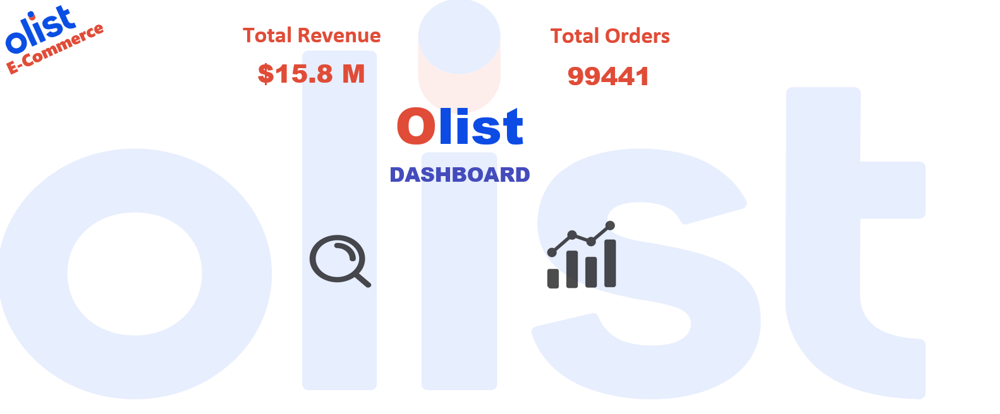
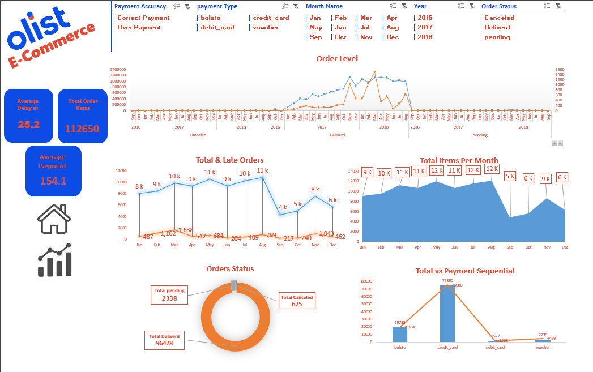
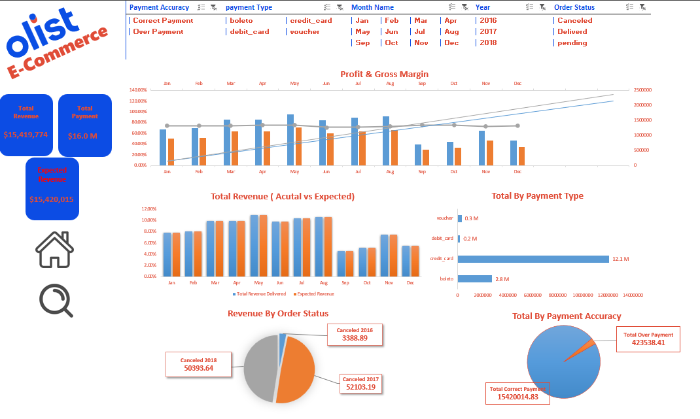

# 📊 Olist E-Commerce Data Analysis Project

Analysis of **Olist**'s Brazilian e-commerce data using Excel — including data cleaning, Pivot Tables, key performance indicators (KPIs), and interactive dashboards built with Slicers.

---

## 📁 File Contents

The `Project_olist.xlsx` file contains several types of sheets:

### 1) Raw Data
| Sheet | Description |
|---|---|
| `olist_orders_dataset` | Order data (purchase, approval, shipping, delivery dates, status) |
| `olist_order_items_dataset` | Order item details (product, seller, price, freight) |
| `olist_order_payments_dataset` | Payment method and value details per order |

### 2) Processed Data
| Sheet | Description |
|---|---|
| `items_dataset` | Simplified version of the items data |
| `payments_dataset` | Simplified version of the payments data |
| `DataSet` | A merged table combining orders + payments + items, with extra calculated columns |

### 3) Calculated Columns
- **Net Profit** per order item
- **Duration Delivery** (actual delivery time)
- **Deliverd Month Name** (delivery month name)
- **Payment Accuracy** (matching payment value against order value: Correct / Over Payment)
- **Total Price / Sum of Freight / Count Orders Item** per order

### 4) Analysis & KPIs
| Sheet | Description |
|---|---|
| `KPIs` | Summary of key metrics: total revenue, expected revenue, total payments |
| `Drill Down` | Detailed breakdown of revenue by year/month and order status |
| `Sheet2` | Monthly revenue + net profit + gross margin (%) |
| `Sheet3` | Revenue by year and order status (Canceled / Delivered / Pending) |
| `Sheet5` | Total orders vs. late orders per month |
| `Sheet6` | Total orders by status |
| `Sheet7` | Revenue by payment type |
| `Sheet8` | Order count by payment type |
| `Sheet9` | Order items count per month |
| `Sheet10` | Revenue by payment accuracy (matched / overpaid) |

### 5) Dashboards
| Sheet | Description |
|---|---|
| `Mirror` | Cover/mirror sheet for dashboard design |
| `Order View` | Dashboard for order-level details |
| `Analysis` | Full analytical dashboard (Pivot Charts) |
| `Slicers` | Interactive slicers to filter dashboards by year/month/status/payment type |

---

## 🎯 Key Metrics (KPIs)

| Metric | Approx. Value |
|---|---|
| Total Revenue (Delivered Orders) | ~$15.42M |
| Expected Revenue | ~$15.42M |
| Total Payment Value | ~$16.01M |
| Total Revenue (All Statuses) | ~$15.84M |
| Total Orders | 99,441 |
| Average Payment | $154.1 |
| Average Delivery Delay | 25.2 days |

---

## 🛠️ Tools Used
- **Microsoft Excel**
  - Power Query / Table Merging
  - Pivot Tables & Pivot Charts
  - Slicers for interactive filtering
  - Calculated Fields / Columns

---

## 🚀 How to Use
1. Download the `Project_olist.xlsx` file.
2. Open it in Excel (2016 or later recommended for full Slicer and Pivot Chart support).
3. Start with the `Analysis` or `Order View` sheets to explore the dashboards, and use the Slicers to filter by time period, order status, or payment type.
4. To review the raw data or verify calculations, check the `DataSet`, `KPIs`, and `Drill Down` sheets.

---

## 📌 Notes
- The data source is the well-known **Brazilian E-Commerce Public Dataset by Olist** (orders, items, and payments).
- Calculated columns (such as Net Profit and Payment Accuracy) were added manually for analysis purposes and are not part of the original dataset.

---

## 📷 Preview

### Cover

### Order View Dashboard

### Analysis Dashboard

---

## 👤 Author
**Thomas Wagdy** — Data Analyst

- GitHub: [ThomasWagdy](https://github.com/ThomasWagdy)
- LinkedIn: [thomas-wagdy](https://www.linkedin.com/in/thomas-wagdy-2355653b3/)
